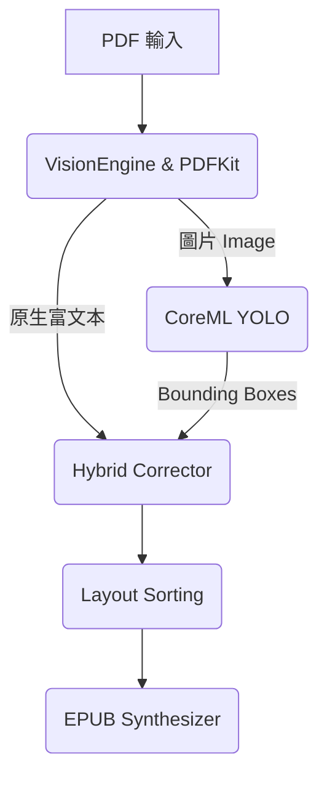

# Make it Flow 🌊

**Make it Flow** 是一款 100% 裝置端運算 (On-device) 的 iOS App / CLI 工具，透過 CoreML YOLO 模型與 PDFKit，將 PDF 文件精準轉換為排版精美、高度可讀的 EPUB 或 Markdown 檔案。

[](https://apps.apple.com/tw/app/make-it-flow/id6780764422?l=en-GB)

## 🚀 快速上手 (Getting Started)

### 環境需求
* macOS 14.0+ / Xcode 15.0+ / iOS 17.0+

### iOS App 執行
1. Clone 專案：`git clone https://github.com/codinguniversefromEric/Make_it_Flow.git`
2. 使用 Xcode 打開 `Flow_1.xcodeproj`。
3. 選擇模擬器或實機，按下 `Cmd + R` 編譯執行。（YOLO 模型已內建，不需額外下載）

### CLI 命令列執行
適合批次處理或自動化腳本。
```bash
cd Flow_CLI
swift run Flow_CLI /path/to/input.pdf /path/to/output.epub
```

```mermaid
flowchart LR
    A([終端機指令]) --> B{參數解析 (Args)}
    B -->|input.pdf| C(載入 PDFKit)
    B -->|模型選擇| D(載入 CoreML 權重)
    
    C --> E[Batch Processor]
    D -.->|nano / small / medium| E
    
    E --> F((Make it Flow 核心引擎))
    F --> G[產生 EPUB / TOC]
    G --> H([儲存至 output.epub])
    
    style A fill:#f96,stroke:#333,stroke-width:2px
    style H fill:#9f6,stroke:#333,stroke-width:2px
    style F fill:#69f,stroke:#333,stroke-width:2px,color:#fff
```

## 🧠 架構總覽 (Architecture)



1. **VisionEngine**: 使用 YOLO 辨識 14 類版面標籤 (Title, Body, Table, Picture 等)。
2. **Hybrid Corrector**: 結合 YOLO 的骨架與 PDFKit 抽取的原生文字座標，進行精準對齊。
3. **Layout Sorting**: 負責幾何排序、跨頁斷句縫合。
4. **EPUB Synthesizer**: 輸出具備響應式 CSS 的出版社級 EPUB。

## 📊 模型與效能 (Benchmarks)

本專案內建三種輕量化 CoreML 模型，來源為 [hantian/yolo-doclaynet](https://huggingface.co/hantian/yolo-doclaynet/tree/main)。所有模型皆在裝置端離線執行。

| 模型 | 大小 | 推論速度 (M晶片) | 適用場景 |
|---|---|---|---|
| **yolo26n** (Nano) | ~5MB | 極快 (< 0.5s/頁) | 適合一般文字 PDF，注重省電與速度。 |
| **yolo26s** (Small) | ~18MB | 快 (~1s/頁) | **預設推薦**。速度與精準度的最佳平衡。 |
| **yolo26m** (Medium)| ~18MB | 中 (~2s/頁) | 適合複雜排版、多欄位、多表格的學術論文。 |

## ⚖️ 授權與致謝

* 程式碼授權：**AGPL-3.0**
* YOLO 框架：[Ultralytics YOLOv8](https://github.com/ultralytics/ultralytics) (AGPL-3.0)
* 模型權重：[hantian/yolo-doclaynet](https://huggingface.co/hantian/yolo-doclaynet/tree/main)

*⚠️ 註："Make it Flow" 品牌名稱及 UI/UX 設計屬作者專屬財產，未經授權禁止重新包裝上架。*

## 🚀 Performance Benchmarks

In comparison to standard PDF parsers (like the `marker` framework), **Make it Flow** delivers native-level performance thanks to CoreML and hardware acceleration.

Based on our benchmark tests on the Hugging Face `marker_benchmark` dataset (a 10-sample subset of highly complex layouts):

| Model | Average Processing Time (per page) | Layout Similarity (Accuracy) | Edit Distance |
|-------|------------------------------------|-----------------------------|---------------|
| **YOLOv26 Nano** | **~0.05 seconds** | **~0.60** | **0.710** |
| **YOLOv26 Small** (Default) | **~0.05 seconds** | **~0.65** | **0.656** |
| **YOLOv26 Medium** | **~0.06 seconds** | **~0.68** | **0.612** |

*Note: Time benchmarks measured on Apple Silicon (M-series) using CoreML Neural Engine acceleration.*

The built-in Swift engine evaluates deep layout bounding boxes instantly and merges them with Apple's native PDFKit data, generating accurate ePub architectures orders of magnitude faster than typical Python-based alternatives.
